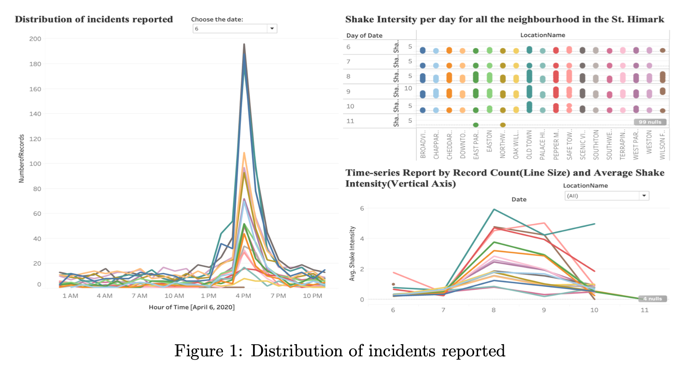
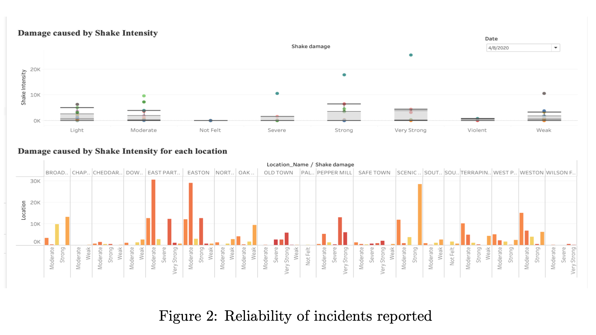

# Vast-Challenge-MC1-2019
Visualizations using Tableau

St. Himark has been struck by an earthquake, sending officials scurrying to assess the extent of the damage and direct limited resources to the most vulnerable locations [1].They acquire seismic readings rapidly and utilize them for an initial deployment, but they realize they need additional information to ensure they have an accurate knowledge of the genuine circumstances throughout the city.

<h2>Data Visualization:</h2>

Core purpose of visualization is to make complicated datasets simpler. Visualization is considered an indispensable part of data science because there is a need to analyze and visualize the data [2]. With the help of our visualization, we answer the following question which will aid the St. Himark’s emergency-officials to respond to the disaster affected area faster.[3]

<h2>Research Questions:</h2>
<ol>
<li><b>Use visual analytics to determine how their response should change based on damage reports from citizens on the ground. How would you prioritize neighborhoods for response? Which parts of the city are hardest hit?</b> 

From the plots [Figure 1], we observe following are instances with high number of incidents were reported:- 
<ul>
<li>6th April 2020 - 13:00-18:00 shows a higher frequency of reports of mostly low intensity values.</li>
<li>8th April 2020 - 09:00-12:00 has a larger concentration of reports with a clear ordering (from most to least severe): power - (medical) - roads and bridges - sewer and water - buildings - medical - shake.</li>
<li>8th April 2020 - 23:35, Thu 01:00, Thu 4:40, Thu 9:15 - four clusters of, probably delayed, reports due to power outages.</li>
<li>9th April 2020 - 15:00-18:00 cluster of reports with sewer and water now being the most severe.</li>
<li>10th April 2020 - 02:30 and Fri 12:00 another burst of probably delayed reports all showing elevated severity across damage types and roads/bridges now being the most severe.</li>
<li>10th April 2020 - 12:00 cluster is probably erroneous as (a) it is logged at exactly 12:00; (b) the shake intensity is higher than earlier reports and does not correspond with any other evidence of a significant tremor at this time.</li></ul>

Based on the shake intensity plot for each neighborhood, we observe that Old Town and Safe Town neighborhoods are highly impacted by the earthquake. Emergency responders can use these plots and respond to highly impacted neighborhoods on priority. They can also view the type of damage occurring - building, road, bridge, power etc and dispatch the relevant emergency team to rescue and fix the damage.

</li>

<li><b>Compare the reliability of neighborhood reports. Which neighborhoods are providing reliable reports?</b>

From the box plot [Figure 2] we observe the interquartile range of the shake intensity for each neighborhood. This provides quartile data, median and the type of damage occurred which determines the reliability of the neighborhood reports. Lesser value of quartile range and smaller variance at a particular instance confirms higher reliability of the reports.  Based on these parameters following neighborhood reports are the most reliable:- 
<ul>
<li>Palace Hills</li>
<li>Scenic Vista</li>
<li>Southton</li>
<li>Southwest</li></ul>
</li>

<li><b>How do conditions change over time? How does uncertainty change over time?</b>

Based on the plots [Figure 3]:- 
<ul>
<li>Apr 06 13:00 to Apr 06 21:00: Most of the locations have a low average level of damage in 6 types of damage. The total number of reports are also low in this time range.</li>
<li>Apr 08 8:00 to Apr 08 15:00: There is the significant increase in number of report as well as high average level of damage in Northwest, Old Town, Scenic Vista, BroadView, Terrapin Springs, Pepper Mills, Easton, Weston, Southon, Oak Willow, East Parton, West Parton. According to that information, we can assume that the first earthquake happens in this time range.</li>
<li>Apr 08 23:45: BroadView has a high number of reports and average level of damage.</li>
<li>Apr 09 1:00: Old Town has a high number of reports and average level of damage.</li>
<li>Apr 09 4:40: Chapparal has a high number of reports and average level of damage.</li>
<li>Apr 09 9:15: Scenic Vista has a high number of reports and average level of damage.</li>
<li>Apr 09 15:00 to Apr 09 20:40: All of the lo- cations except Old Town and Wilson Forest.</li>
<li>Apr 10 2:30: Scenic Vista has a high number of reports and average level of damage.</li>
</ul>
</li>      
</ol>

<h2>Conclusion:</h2>

Crowdsourced data may differ significantly, particularly if the reports are based on arbitrary measurements. Visualization aids greatly in understanding the dataset (static or dynamic). We have used Tableau with python integration to create a system for emergency responders.[4] In the scenario, we get live data, we can append the live data in the data source and plots will be readjusted. Generation of patterns display linear relation between shake intensity and type of damage. From the above plot [Figure 4] and its coefficients we can conclude that there is a better linear relation between shake intensity and ‘medical damage and power damage’ than ‘building damage, road and sewer damage’. As future work, we can generate prediction models where shake intensity can predict the type of damage caused.[5] Eventually it will lead to better dispatch of the emergency responder team and quick resolution and rescue in the event of such a catastrophic event.

<h2>References:</h2>
[1] K. A. Cook and J. J. Thomas, “Illuminating the path: The research and development agenda for visual analytics,” Pacific Northwest National Lab.(PNNL), Richland, WA (United States), Tech. Rep., 2005. 
[2] E. Tufte, “The visual display of quantitative information.” 
[3] C. Ware, “Information visualization: Perception for design, waltham, ma,” 2012. 
[4] J. Bertin, Semiology of graphics. University of Wisconsin press, 1983. 
[5] J. Kohlhammer, D. Keim, M. Pohl, G. Santucci, and G. Andrienko, “Solving problems with visual analytics,” Procedia Computer Science, vol. 7, pp. 117–120, 2011. 
